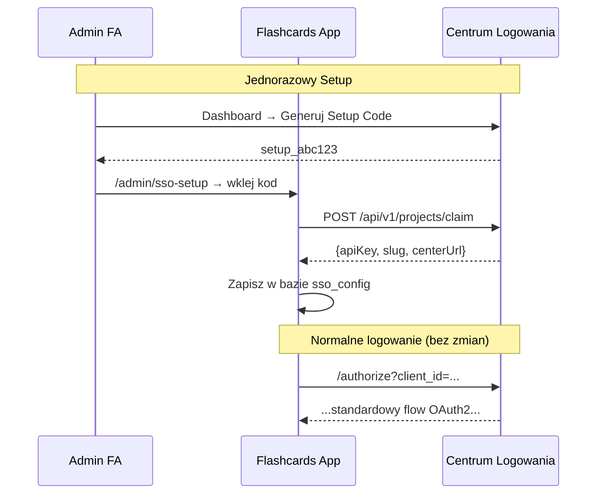

# Plan Migracji: Flashcards App → Nowe CLA

> **Cel**: Przejście z konfiguracji `.env` na dynamiczną konfigurację przez Setup Code z nowego Centrum Logowania

---

## Przegląd Etapów

| Etap | Nazwa | Szacowany czas | Zależności |
|------|-------|----------------|------------|
| 1 | Schemat bazy - tabela konfiguracji | 30min | CLA Etap 1-2 ukończony |
| 2 | Modyfikacja sso-client.ts | 1h | Etap 1 |
| 3 | Strona Setup dla administratora | 1-2h | Etap 2 |
| 4 | Migracja z .env (opcjonalne) | 30min | Etap 3 |
| 5 | Testy i cleanup | 1h | Wszystkie |

**Łączny szacowany czas**: 4-5h

---

## Wymagania Wstępne

> [!IMPORTANT]
> Przed rozpoczęciem migracji FA, upewnij się że CLA ma ukończone **Etapy 1-2** (Setup Code backend + UI).

---

## Etap 1: Schemat Bazy - Tabela Konfiguracji

### 1.1 Nowa tabela w schemacie

**Plik**: `lib/db/schema.ts`

```typescript
// Konfiguracja SSO (singleton - jeden rekord)
export const ssoConfig = flashcardsSchema.table("sso_config", {
  id: uuid("id").defaultRandom().primaryKey(),
  apiKey: text("api_key").notNull(),
  projectSlug: varchar("project_slug", { length: 255 }).notNull(),
  centerUrl: text("center_url").notNull(),
  projectName: text("project_name"), // opcjonalne, dla UI
  configuredAt: timestamp("configured_at").defaultNow().notNull(),
  configuredBy: varchar("configured_by", { length: 255 }).references(() => users.id, {
    onDelete: "set null",
  }),
});
```

### 1.2 Migracja bazy danych

```bash
npx drizzle-kit generate
npx drizzle-kit migrate
```

### 1.3 Checklist Etapu 1

- [ ] Dodać tabelę `ssoConfig` do `lib/db/schema.ts`
- [ ] Uruchomić migrację Drizzle
- [ ] Zweryfikować że tabela została utworzona

---

## Etap 2: Modyfikacja sso-client.ts

### 2.1 Nowa funkcja pobierania konfiguracji

**Plik**: `lib/sso-client.ts`

Dodaj nową funkcję:

```typescript
import { db } from '@/lib/db/drizzle';
import { ssoConfig } from '@/lib/db/schema';

interface SSOConfigData {
  apiKey: string;
  projectSlug: string;
  centerUrl: string;
}

/**
 * Pobiera konfigurację SSO z bazy danych.
 * Fallback na zmienne środowiskowe jeśli brak konfiguracji w bazie.
 */
async function getConfig(): Promise<SSOConfigData> {
  // Spróbuj pobrać z bazy
  const dbConfig = await db.query.ssoConfig.findFirst();
  
  if (dbConfig) {
    return {
      apiKey: dbConfig.apiKey,
      projectSlug: dbConfig.projectSlug,
      centerUrl: dbConfig.centerUrl,
    };
  }
  
  // Fallback na .env (dla kompatybilności wstecznej)
  return {
    apiKey: process.env.SSO_API_KEY || '',
    projectSlug: process.env.SSO_CLIENT_ID || process.env.NEXT_PUBLIC_SSO_CLIENT_ID || '',
    centerUrl: process.env.SSO_CENTER_URL || process.env.NEXT_PUBLIC_SSO_CENTER_URL || '',
  };
}
```

### 2.2 Modyfikacja SSO_CONFIG

Zmień `SSO_CONFIG` na funkcję asynchroniczną lub lazy-loading:

```typescript
// PRZED:
export const SSO_CONFIG = {
  defaultCenterUrl: process.env.SSO_CENTER_URL || ...,
  clientId: process.env.SSO_CLIENT_ID || ...,
  apiKey: process.env.SSO_API_KEY || '',
  // ...
};

// PO:
let cachedConfig: SSOConfigData | null = null;

export async function getSSOConfig(): Promise<SSOConfigData> {
  if (!cachedConfig) {
    cachedConfig = await getConfig();
  }
  return cachedConfig;
}

// Dla statycznych wartości (nie zależą od bazy)
export const SSO_STATIC_CONFIG = {
  sessionMaxAge: 30 * 24 * 60 * 60 * 1000,
  verifyInterval: 5 * 60 * 1000,
};
```

### 2.3 Aktualizacja funkcji używających konfiguracji

Funkcje które używają `SSO_CONFIG` muszą być zaktualizowane:

| Funkcja | Zmiana |
|---------|--------|
| `getCenterUrl()` | Pobierz z `getSSOConfig()` |
| `exchangeCodeForUser()` | Pobierz `apiKey` z `getSSOConfig()` |
| `verifySessionWithCenter()` | Pobierz `apiKey` z `getSSOConfig()` |
| `logoutFromCenter()` | Pobierz `clientId` z `getSSOConfig()` |

### 2.4 Invalidacja cache przy zmianie konfiguracji

```typescript
export function invalidateSSOConfigCache(): void {
  cachedConfig = null;
}
```

### 2.5 Checklist Etapu 2

- [ ] Dodać funkcję `getConfig()` pobierającą z bazy
- [ ] Zmienić `SSO_CONFIG` na `getSSOConfig()` (async)
- [ ] Zaktualizować `getCenterUrl()`
- [ ] Zaktualizować `exchangeCodeForUser()`
- [ ] Zaktualizować `verifySessionWithCenter()`
- [ ] Zaktualizować `logoutFromCenter()`
- [ ] Dodać `invalidateSSOConfigCache()`
- [ ] Przetestować z obecną konfiguracją .env (fallback)

---

## Etap 3: Strona Setup dla Administratora

### 3.1 Nowa strona setup

**Plik**: `app/(admin)/admin/sso-setup/page.tsx`

```typescript
// Strona dostępna tylko dla adminów (lub pierwszy setup)
// - Input na Setup Code z CLA
// - Przycisk "Połącz z Centrum Logowania"
// - Wyświetlenie aktualnej konfiguracji (jeśli istnieje)
```

**Funkcjonalności**:
1. Sprawdź czy już jest skonfigurowane
2. Formularz z polem na Setup Code
3. Po wysłaniu → `POST /api/admin/sso-setup`
4. Wyświetl sukces z nazwą projektu

### 3.2 API Route do konfiguracji

**Plik**: `app/api/admin/sso-setup/route.ts`

```typescript
// POST /api/admin/sso-setup
// Body: { setupCode: "setup_abc123" }
// 
// Logika:
// 1. Sprawdź czy user jest adminem
// 2. Wyślij request do CLA: POST /api/v1/projects/claim
// 3. Zapisz odpowiedź w tabeli ssoConfig
// 4. Invaliduj cache SSO config
// 5. Zwróć sukces
```

### 3.3 Komponent formularza

**Plik**: `components/admin/SSOSetupForm.tsx`

```typescript
'use client';

import { useState } from 'react';
import { Button } from '@/components/ui/button';
import { Input } from '@/components/ui/input';
import { Card, CardContent, CardHeader, CardTitle } from '@/components/ui/card';

export function SSOSetupForm() {
  const [setupCode, setSetupCode] = useState('');
  const [loading, setLoading] = useState(false);
  const [result, setResult] = useState<{ success: boolean; message: string } | null>(null);

  const handleSubmit = async (e: React.FormEvent) => {
    e.preventDefault();
    setLoading(true);
    
    const response = await fetch('/api/admin/sso-setup', {
      method: 'POST',
      headers: { 'Content-Type': 'application/json' },
      body: JSON.stringify({ setupCode }),
    });
    
    const data = await response.json();
    setResult(data);
    setLoading(false);
  };

  return (
    <Card>
      <CardHeader>
        <CardTitle>Konfiguracja SSO</CardTitle>
      </CardHeader>
      <CardContent>
        <form onSubmit={handleSubmit} className="space-y-4">
          <Input
            placeholder="Wklej Setup Code z Centrum Logowania"
            value={setupCode}
            onChange={(e) => setSetupCode(e.target.value)}
          />
          <Button type="submit" disabled={loading}>
            {loading ? 'Łączenie...' : 'Połącz z Centrum'}
          </Button>
        </form>
        {result && (
          <div className={result.success ? 'text-green-600' : 'text-red-600'}>
            {result.message}
          </div>
        )}
      </CardContent>
    </Card>
  );
}
```

### 3.4 Checklist Etapu 3

- [ ] Utworzyć stronę `app/(admin)/admin/sso-setup/page.tsx`
- [ ] Utworzyć API route `app/api/admin/sso-setup/route.ts`
- [ ] Utworzyć komponent `SSOSetupForm`
- [ ] Dodać link w panelu admina
- [ ] Wyświetlić aktualną konfigurację (jeśli istnieje)
- [ ] Opcja "Zmień konfigurację" (nowy setup code)

---

## Etap 4: Migracja z .env (Opcjonalne)

### 4.1 Skrypt migracji

Jeśli chcesz automatycznie przenieść obecną konfigurację z `.env` do bazy:

**Plik**: `scripts/migrate-sso-config.ts`

```typescript
import { db } from '@/lib/db/drizzle';
import { ssoConfig } from '@/lib/db/schema';

async function migrateFromEnv() {
  const existing = await db.query.ssoConfig.findFirst();
  
  if (existing) {
    console.log('✅ Konfiguracja SSO już istnieje w bazie');
    return;
  }
  
  const apiKey = process.env.SSO_API_KEY;
  const projectSlug = process.env.SSO_CLIENT_ID || process.env.NEXT_PUBLIC_SSO_CLIENT_ID;
  const centerUrl = process.env.SSO_CENTER_URL || process.env.NEXT_PUBLIC_SSO_CENTER_URL;
  
  if (!apiKey || !projectSlug || !centerUrl) {
    console.log('⚠️ Brak pełnej konfiguracji w .env');
    return;
  }
  
  await db.insert(ssoConfig).values({
    apiKey,
    projectSlug,
    centerUrl,
  });
  
  console.log('✅ Zmigrowano konfigurację z .env do bazy');
}

migrateFromEnv();
```

### 4.2 Uruchomienie

```bash
npx tsx scripts/migrate-sso-config.ts
```

### 4.3 Cleanup .env

Po pomyślnej migracji można usunąć z `.env`:

```diff
- SSO_CENTER_URL=https://centrum-logowania-app.vercel.app
- SSO_CLIENT_ID=flashcards-uk61
- SSO_API_KEY=cl_secret_xyz123
- NEXT_PUBLIC_SSO_CENTER_URL=https://centrum-logowania-app.vercel.app
- NEXT_PUBLIC_SSO_CLIENT_ID=flashcards-uk61
```

### 4.4 Checklist Etapu 4

- [ ] Utworzyć skrypt `scripts/migrate-sso-config.ts`
- [ ] Uruchomić skrypt na lokalnej bazie
- [ ] Zweryfikować działanie logowania
- [ ] Usunąć zmienne SSO z `.env` (opcjonalnie)
- [ ] Uruchomić migrację na produkcji

---

## Etap 5: Testy i Cleanup

### 5.1 Testy do wykonania

| Test | Opis |
|------|------|
| Fallback .env | Usuń rekord z bazy → logowanie działa z .env |
| Setup nowej konfiguracji | Użyj Setup Code → konfiguracja zapisana |
| Logowanie po setup | Nowa konfiguracja → logowanie działa |
| Cache invalidation | Zmień konfigurację → używa nowej |

### 5.2 Aktualizacja dokumentacji

- [ ] Zaktualizować `README.md` - nowy sposób konfiguracji
- [ ] Zaktualizować `SETUP_WORKFLOW.md` (jeśli istnieje)
- [ ] Dodać sekcję "Konfiguracja SSO przez UI"

### 5.3 Cleanup kodu

- [ ] Usunąć nieużywane zmienne z `.env.example`
- [ ] Usunąć komentarze TODO związane z migracją
- [ ] Code review

### 5.4 Checklist Etapu 5

- [ ] Przetestować fallback na .env
- [ ] Przetestować pełny flow z Setup Code
- [ ] Przetestować logowanie/wylogowanie
- [ ] Zaktualizować dokumentację
- [ ] Cleanup kodu

---

## Podsumowanie Zmian

### Nowe pliki

| Plik | Opis |
|------|------|
| `app/(admin)/admin/sso-setup/page.tsx` | Strona konfiguracji SSO |
| `app/api/admin/sso-setup/route.ts` | API do zapisywania konfiguracji |
| `components/admin/SSOSetupForm.tsx` | Formularz setup code |
| `scripts/migrate-sso-config.ts` | Skrypt migracji z .env |

### Zmodyfikowane pliki

| Plik | Zmiana |
|------|--------|
| `lib/db/schema.ts` | Nowa tabela `ssoConfig` |
| `lib/sso-client.ts` | Pobieranie konfiguracji z bazy |

### Schemat bazy

```diff
+ flashcards.sso_config (id, api_key, project_slug, center_url, ...)
```

---

## Flow Po Migracji



---

## Kompatybilność

| Scenariusz | Działa? |
|------------|---------|
| Brak konfiguracji w bazie, jest .env | ✅ Fallback |
| Jest konfiguracja w bazie, brak .env | ✅ Używa bazy |
| Jest w bazie i .env | ✅ Priorytet: baza |
| Brak w bazie i brak .env | ❌ Błąd (wymaga setup) |
